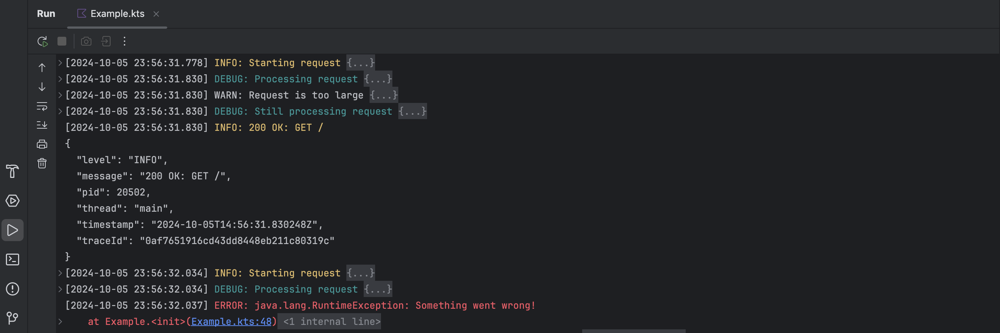

#  Pretty JSON Log plugin

## Template ToDo list

- [x] Create a new [IntelliJ Platform Plugin Template][template] project.
- [x] Get familiar with the [template documentation][template].
- [x] Adjust the [pluginGroup](./gradle.properties), [plugin ID](./src/main/resources/META-INF/plugin.xml)
  and [sources package](./src/main/kotlin).
- [x] Adjust the plugin description in `README` (see [Tips][docs:plugin-description])
- [x] Review
  the [Legal Agreements](https://plugins.jetbrains.com/docs/marketplace/legal-agreements.html?from=IJPluginTemplate).
- [ ] [Publish a plugin manually](https://plugins.jetbrains.com/docs/intellij/publishing-plugin.html?from=IJPluginTemplate)
  for the first time.
- [ ] Set the `PLUGIN_ID` in the above README badges.
- [ ] Set the [Plugin Signing](https://plugins.jetbrains.com/docs/intellij/plugin-signing.html?from=IJPluginTemplate)
  related [secrets](https://github.com/JetBrains/intellij-platform-plugin-template#environment-variables).
- [ ] Set
  the [Deployment Token](https://plugins.jetbrains.com/docs/marketplace/plugin-upload.html?from=IJPluginTemplate).
- [ ] Click the <kbd>Watch</kbd> button on the top of the [IntelliJ Platform Plugin Template][template] to be notified
  about releases containing new features and fixes.

<!-- Plugin description -->
Pretty JSON Log plugin for IntelliJ Platform makes NDJSON (Newline Delimited JSON a.k.a. JSON Lines) logs more readable
in the console. It has the following features:

- **JSON Parsing**: Automatically parses each log line as JSON and extracts essential log information such as timestamp,
  log level, and message.
- **Colorful Display**: Displays essential log information in different colors depending on the log level to make it
  easier to read.
- **Readable Timestamp**: Formats the timestamp in a human-friendly format.
- **Expandable Pretty JSON**: Prints a well-formatted JSON string following the log message. The JSON string is folded
  by default, but you can expand it when you need to view the full details.
- **Seamless Integration**: Supports various log formats such
  as [Logstash](https://github.com/logfellow/logstash-logback-encoder), [Bunyan](https://github.com/trentm/node-bunyan),
  [Pino](https://github.com/pinojs/pino), [log/slog](https://pkg.go.dev/log/slog),
  [Cloud Logging](https://cloud.google.com/logging/docs/structured-logging), etc. with no additional configuration or
  software.

This plugin is useful when you are developing a modern system that outputs logs in JSON format. You no longer need to
switch log formats between production and local development environments.
<!-- Plugin description end -->

## Installation

- Using the IDE built-in plugin system:

  <kbd>Settings/Preferences</kbd> > <kbd>Plugins</kbd> > <kbd>Marketplace</kbd> > <kbd>Search for "Pretty JSON
  Log"</kbd> > <kbd>Install</kbd>

- Manually:

  Download the [latest release](https://github.com/orangain/pretty-json-log-plugin/releases/latest) and install it
  manually using
  <kbd>Settings/Preferences</kbd> > <kbd>Plugins</kbd> > <kbd>⚙️</kbd> > <kbd>Install plugin from disk...</kbd>

---
This plugin is inspired by the [pino-pretty](https://github.com/pinojs/pino-pretty)
and [bunyan CLI](https://github.com/trentm/node-bunyan). It is based on
the [IntelliJ Platform Plugin Template][template].

[template]: https://github.com/JetBrains/intellij-platform-plugin-template

[docs:plugin-description]: https://plugins.jetbrains.com/docs/intellij/plugin-user-experience.html#plugin-description-and-presentation
